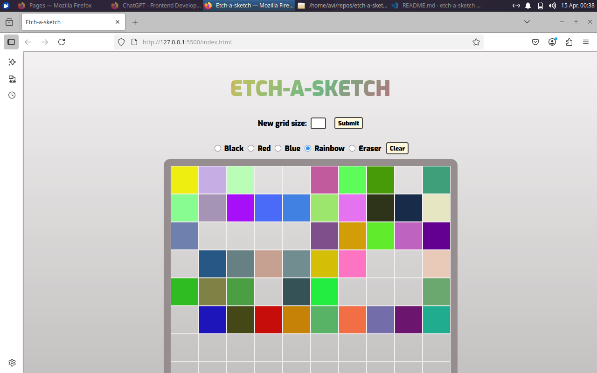

# etch-a-sketch

A fun browser-based sketching tool built with **HTML**, **CSS**, and **JavaScript**. Inspired by the classic Etch-a-Sketch toy and completes the odin project task, this interactive app lets you draw with various colors, erase, and create customizable grid sizes!

## 🌟 Features

- 🎨 Draw with black, red, blue, rainbow colors or use an eraser
- 📐 Customized grid size (2x2 to 99x99)
- 🔄 Clears the canvas with a single click
- 🌈 Rainbow pen generates random colors on hover
- 🖱️ Mouseover-based drawing interaction

## 📷 Screenshot

